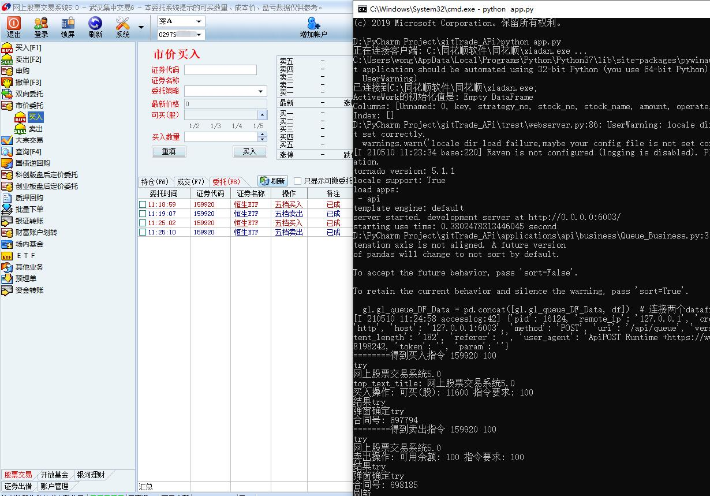
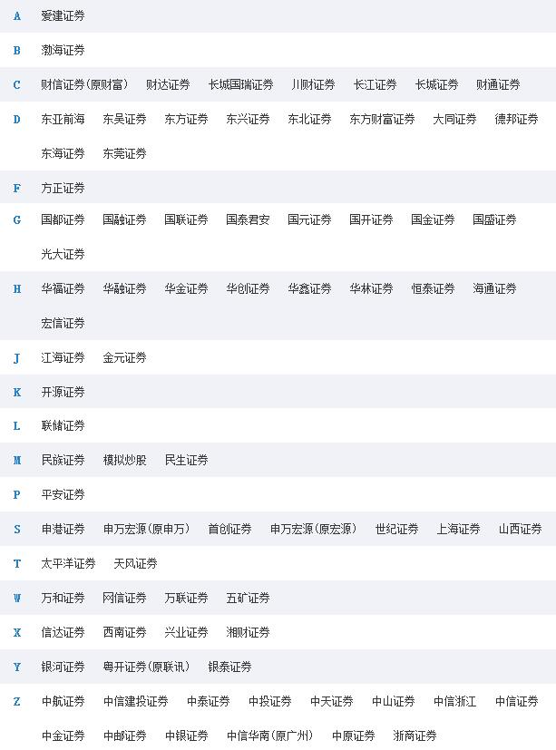
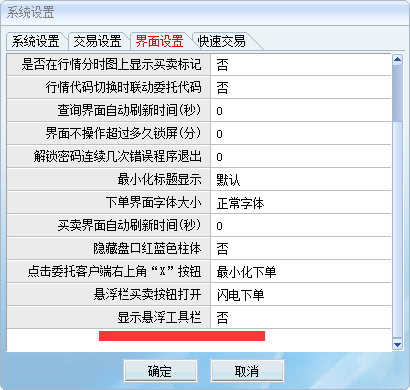
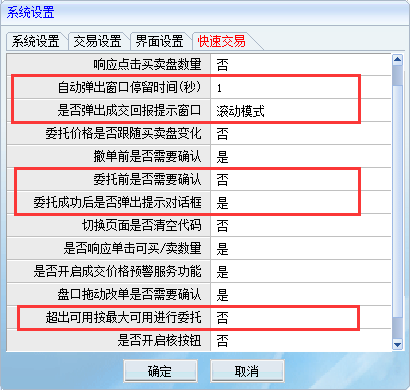

# ths_trade
同花顺自动化交易接口, 量化交易必备工具, 支持分策略交易和查询, 多年实盘自动化交易

# **同花顺自动化交易**

本实例操作自动化交易的是同花顺的 xiadan.exe 程序，支持市价买入、市价卖出、查询成交；

_市价委托为达到指令的快速成交，所以使用的市价委托_；

支持多策略发送交易指令，交易指令自动进入队列，逐条执行交易，可同时向交易程序发送交易指令；服务框架采用基于强大的异步网络库 tornado;




---

# **说明**

交易服务运行需要开启一个同花顺交易客户端，对同花顺交易客户端 没有做任何修改和破解，所以没有法律上的问题;

交易服务 API 不带任何界面，API 可以不受约束的下发交易查询指令，对多种编程语言都可以调用;

---

## **环境**

> Windows 7 SP1 及以上

> Python 3.7

> 同花顺 xiadan.exe

---

## **支持的券商**

交易服务运行需要开启一个同花顺交易客户端，对同花顺交易客户端 没有做任何修改和破解。 实际支持的券商和功能以满足监管要求为准，通过应用层的处理，方便通过同花顺下单，同花顺交易端支持 70~80 家券商，下方是支持的部分券商名单（完整券商名单请见：同花顺交易客户端相关->下载）：



---

## **实盘效果**

先上个实盘操作买卖效果如下图

交易服务程序启动后, 使用工具向 api 发送数据; 发送数据后自动进入队列, 开始实盘交易;


---

## **同花顺设置**

### **同花顺网上交易 5.0 以上的可以控制**

**在同花顺安装目录下面的 xiadan.exe 程序的 系统>**

### **界面设置**

        显示悬浮工具栏	【否】

### **快速交易**

        自动弹出窗口停留时间【1】秒
        是否弹出成交回报提示窗口     【滚动模式】
        委托前是否需要确认          【否】
        委托成功后弹出提示对话框     【是】
        超出可用按最大可用进行委托   【否】



---

## **安装依赖库**

```
    pip install -U pip

    pip install -r requirements.txt

    pip install  pywinauto

```

---

## **配置交易服务参数**

在**applications/API_Config.py**中配置交易服务程序的参数

```
cfg = {
    # 同花顺xiadan.exe 所在位置
    'exe_path': 'C:\\同花顺软件\\同花顺\\xiadan.exe',

    # 活动的工作流文件路径
    "activework_path": "./applications/work_queue/ActiveWork.csv",
    # 活动的工作流文件字段
    "activework_field": ["key", "strategy_no", "stock_no", "stock_name",
                         "amount", "operate", "status"],

    # 自动化交易工作数据记录文件路径
    "workdatalog_path": "./applications/Work_Data_Log.csv",
    # 保存csv的自动化交易工作记录
    'workdata_field': ["key", "委托时间", "证券代码", "证券名称", "操作", "备注",
                       "委托数量", "成交数量", "委托价格", "成交均价",
                       "撤消数量", "合同编号", "策略编号"],

    # 自动化交易休眠时间间隔
    "sleepA": 0.2,
    "sleepB": 0.5,
    "sleepC": 1,
}


```

---

## **自动化交易运行**

运行文件 app.py 启动自动化交易服务，服务启动后就可以用程序调用买入卖出查询;

```
    python app.py
```

运行后服务程序的端口为 6003, 可以向服务程序接口发送指令了;

---

### **买入和卖出** 接口调用

接口地址

> http://127.0.0.1:6003/api/queue

参数类型

> application/json

传递参数 json 数组

```
[
	{
		"strategy_no": "1001",
		"code": "513030",
		"name": "德国30",
		"ct_amount": 100,
		"operate": "buy"
	},
	{
		"strategy_no": "1001",
		"code": "162411",
		"name": "华宝油气",
		"ct_amount": 100,
		"operate": "sell"
	}
]
```

参数说明

| 参数名      | 参数描述                 | 类型   | 必填 |
| ----------- | :----------------------- | :----- | ---: |
| strategy_no | 策略编号                 | string |   是 |
| code        | 股票代码/标的            | string |   是 |
| name        | 股票名称                 | string |   是 |
| ct_amount   | 数量                     | int    |   是 |
| operate     | 买卖: buy:买入 sell:卖出 | string |   是 |

---

### **查询成交** 接口调用

接口地址

> http://127.0.0.1:6003/api/search

参数类型

> application/json

传递参数

```
{
	"strategy_no": "A101",
	"operate": "get_today_entrusts"
}

```

参数说明

| 参数名      | 参数描述 | 类型   | 必填 |
| ----------- | :------- | :----- | ---: |
| strategy_no | 策略编号 | string |   是 |
| operate     | 查询什么 | string |   是 |

**查询什么**

> get_position 获取市价委托的 F6 持仓

> get_today_trades 获取市价委托的 F7 当日成交

> get_today_entrusts 获取市价委托的 F8 委托 **(推荐使用此种方式查询委托的成交)**

> get_balance 获取资金情况

---

## **长期运行**

交易服务可运行于**个人电脑** 或 **云服务器**；

> 个人电脑：交易服务运行后，完成交易指令需要获取电脑的焦点，所以交易服务正在交易时不要使用鼠标，使 xiadan 程序前置;
>
> 云服务器(**推荐**)：在云服务器端安装使用 VNCServer 工具，在客户端安装 VNCClient 远程连接云服务器，实测使用此工具可以随时连接和断开连接而不影响云服务器的焦点，可以长期运行，只要客户策略端向交易服务发送接口即可进入交易队列，等待交易;

_不要使用远程桌面(mstsc)来连接云服务器，此工具在断开连接后，云服务器会退出登录，交易服务就无法完成后续交易_

**实盘跑交易服务在云服务器(VNC 工具连接)稳定轻松运行**

---

## **交易队列**

在 applications/work_queue 文件夹下的 ActiveWork.csv 文件是交易的队列

---

| key                                  | strategy_no | stock_no | stock_name | amount | operate | status |
| ------------------------------------ | ----------- | -------- | ---------- | ------ | ------- | ------ |
| 536f341c-40fe-11eb-b47a-fcaa14e6e347 | 1001        | 510900   | H 股 ETF   | 100    | buy     | 1      |
| 543f341c-42fe-15eb-b46a-sega14e6e864 | 1001        | 510900   | H 股 ETF   | 100    | buy     | 0      |

---

如果调整过程中程序异常, 检查此交易队列中的 status 有没有为 0(未执行)的数据, 如果不需要再次执行则可以删除整行;

未执行的, 下次交易服务再次运行时会自动检测队列;

如果修改文件请使用开发工具打开 或 EditPlus 或 Notepad++ ;
避免使用文本文件打开修改后出现编码问题;

---

## **注意事项**

运行顺序

1. 运行 xiadan.exe 输入个人帐号密码登录进入主程序界面；
2. 运行自动化交易控制程序； 运行后, 交易程序会控制到 xiadan 程序；

打开项目使用 Pycharm 或 VSCode ;

---

# **巴特量化**

- 数字货币 股市量化工具 行情系统软件开发

- BTC 虚拟货币量化交易策略开发 自动化交易策略运行


---

